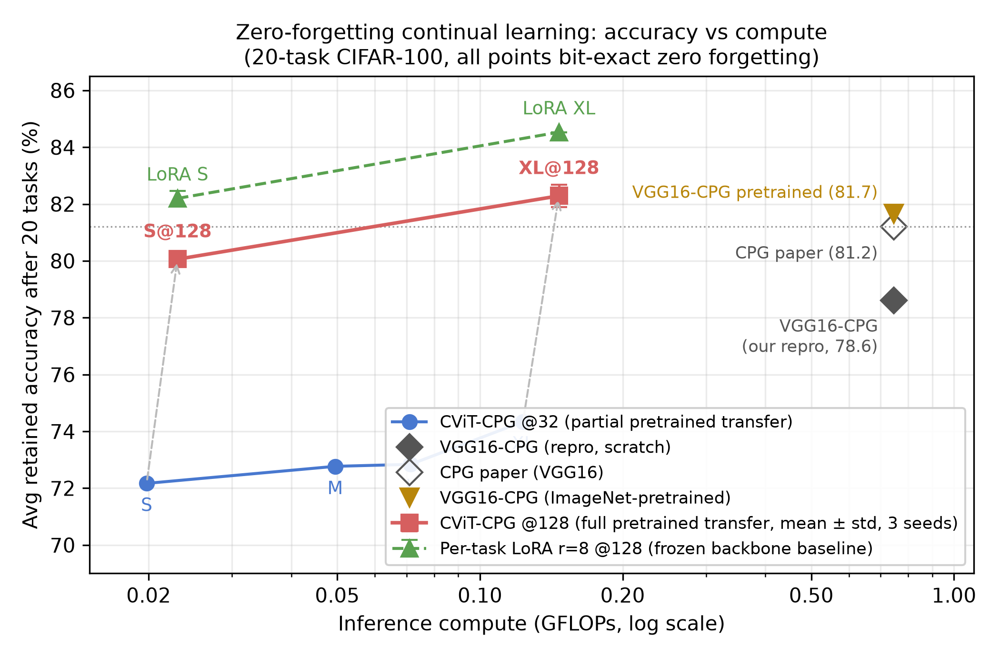
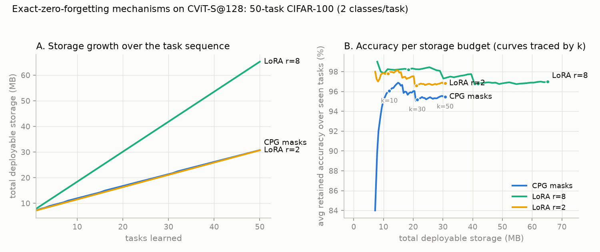
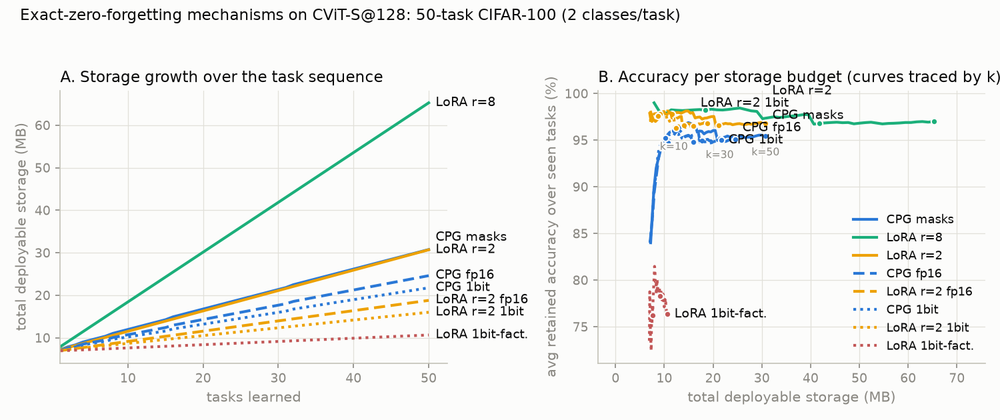

# Technical Report: Zero-Forgetting Continual Learning on the CascadedViT Family (CViT-CPG)

**Author environment:** Windows 11 Pro, single NVIDIA RTX 3060 (12 GB), PyTorch 2.6.0+cu124, Python venv.
**Date:** July 2026.
**Codebase:** `CPG_vclab/` — `official_CPG/` (reference CPG implementation, patched) and `cvit_cifar/` (all new code).

---

## 1. Objective and research questions

The project ports the CPG continual-learning method (Compacting, Picking and Growing, Hung et al., NeurIPS 2019) from its original VGG16 backbone onto the CascadedViT (CViT) family of efficient hybrid vision transformers, and quantifies the resulting accuracy-per-compute trade-off on the standard 20-task CIFAR-100 benchmark.

Three research questions structure the work:

- **RQ1 (mechanism transfer):** Does CPG's weight-ownership masking mechanism, designed for plain convolutional networks, still give *exact* zero forgetting when applied to a modern hybrid ViT containing depthwise convolutions, squeeze-and-excitation modules, cascaded group attention, and chunked feed-forward layers?
- **RQ2 (efficiency):** How much continual-learning accuracy per unit of inference compute does the CViT backbone deliver relative to the original VGG16 backbone?
- **RQ3 (scaling):** Along which axis (width, depth, initialization) does the efficient backbone close the accuracy gap to VGG16-CPG, and where does the Pareto frontier lie?

Headline answers: (RQ1) yes, exactly — frozen-weight drift is bit-exact 0.00e+00 at every model size (checksum-verified), and after extending the per-task store to every unmasked trainable tensor (Section 5.4), BWT is +0.000 % and old-task logits are reproduced bit-for-bit in every run; (RQ2) 5.3–34.5x higher continual Accuracy-Per-FLOP (5.3x = XL at 128px, the accuracy point; 34.5x = S at 32px, the efficiency point; the 32px family alone spans 5.7–34.5x, Section 9.4); (RQ3) depth, not width, and ImageNet-pretrained initialization; efficiency frontier at CViT-S, accuracy frontier at CViT-XL.

---

## 2. Background

### 2.1 The CPG method

CPG achieves *zero forgetting by construction* rather than by regularization. Its state is an integer **ownership mask** with one entry per weight of every maskable layer:

- `mask[i] = 0` — weight `i` is free (unowned).
- `mask[i] = k` — weight `i` is owned by task `k`; it was trained during task `k` and is **frozen forever afterwards**.

Per task, the pipeline has three stages:

1. **Training / picking.** The current task `t` trains only the free weights (`mask == 0`). Gradients of weights owned by earlier tasks are zeroed after every backward pass, so owned weights cannot move (Section 5.2). For tasks `t > 1`, the task may additionally *pick* (reuse, read-only) old weights through a learned binary **piggymask**: a real-valued mask per layer, binarized in the forward pass at threshold 5e-3 with a straight-through estimator, so old weights contribute to the new task's function without being modified.
2. **Compacting (gradual pruning).** The task's newly trained weights are magnitude-pruned over several epochs on a cubic sparsity schedule up to a target sparsity (60 % in all our runs unless stated otherwise; Section 9.10 restores the original method's accuracy-goal retry at lower sparsity), then briefly re-finetuned. Surviving weights get `mask = t` and freeze; pruned weights return to `mask = 0` and become the free pool for future tasks.
3. **Growing.** If the free pool is exhausted, the original method widens every layer by a multiplier and adds the new columns/rows to the free pool. (On CViT the published width-multiplier form is architecturally unsound, but the stage is restored exactly at head/chunk granularity — Section 8.)

Statistics that are inherently task-specific and cannot be masked at weight granularity are stored **per task** and swapped at inference: the classification head, all BatchNorm affine parameters and running statistics, and (our additions, Section 5.4) all convolution biases and the attention-bias tables.

Because forgetting is prevented by exact weight freezing, the method's guarantee is *falsifiable at bit level*: if any frozen weight changes by even one ULP, the implementation is broken. We exploit this for verification (Section 6).

### 2.2 The CascadedViT backbone

CascadedViT is an EfficientViT-lineage hybrid ViT designed for low-FLOP inference. The pieces that matter for this work:

- **Conv2d_BN**: a Conv2d followed by BatchNorm2d, the basic building block (also used inside attention as projections).
- **Cascaded Group Attention (CGA)**: the token feature vector is split into `num_heads` *contiguous channel chunks* (`x.chunk(num_heads, dim=1)`); each head attends over its chunk, and each head's output is *cascaded* (added) into the next head's input. Attention uses learned relative position biases (`attention_biases`) per window.
- **CFFN (cascaded chunk FFN)**: the FFN input is split into contiguous chunks (`x.chunk(num_chunks, dim=1)`) processed sequentially with cascading additions.
- **Depthwise convolutions and Squeeze-and-Excitation (SE)** modules inside the stem/downsampling blocks.
- Three resolution **stages** with per-stage embedding dimension, depth, and head count.

The contiguous-chunk routing in CGA and CFFN is the single most consequential architectural fact in this report: it is what breaks naive network growing, and what dictates the growth axis that works (Section 8).

### 2.3 Benchmark

The standard CPG Experiment-1 protocol: CIFAR-100's 100 fine classes are grouped into their 20 semantic superclasses; each superclass is one task with 5 classes (2,500 train / 500 test images per task, labels remapped to 0–4). Tasks arrive sequentially in the fixed published order (aquatic_mammals first, vehicles_2 last). Task identity is known at test time (task-incremental setting); each task is evaluated with its own head, BN set, and the union of masks for tasks 1..t.

---

## 3. Phase A — reference reproduction and backbone adaptation

### 3.1 Phase A1: VGG16-CPG reproduction

We reproduced the paper's Experiment 1 with the official code (`official_CPG/`), VGG16 with network width multiplier 1.5, driven by a Windows-native Python driver `run_experiment1.py` (the released bash scripts are not usable on Windows). The paper comparison below uses the CPG paper's `CPG max` row, the row with the reported 81.2 % average:

| # | Task | Ours (%) | Paper (%) | Diff |
|---|------|:---:|:---:|:---:|
| 1 | aquatic_mammals | 63.00 | 67.0 | -4.00 |
| 2 | fish | 76.60 | 79.2 | -2.60 |
| 3 | flowers | 78.20 | 77.2 | +1.00 |
| 4 | food_containers | 79.00 | 82.0 | -3.00 |
| 5 | fruit_and_vegetables | 85.60 | 86.8 | -1.20 |
| 6 | household_electrical_devices | 81.40 | 87.2 | -5.80 |
| 7 | household_furniture | 80.80 | 82.0 | -1.20 |
| 8 | insects | 82.00 | 85.6 | -3.60 |
| 9 | large_carnivores | 84.00 | 86.4 | -2.40 |
| 10 | large_man-made_outdoor_things | 87.00 | 89.6 | -2.60 |
| 11 | large_natural_outdoor_scenes | 87.00 | 90.0 | -3.00 |
| 12 | large_omnivores_and_herbivores | 80.20 | 84.0 | -3.80 |
| 13 | medium_mammals | 85.80 | 87.2 | -1.40 |
| 14 | non-insect_invertebrates | 82.40 | 84.8 | -2.40 |
| 15 | people | 50.60 | 55.4 | -4.80 |
| 16 | reptiles | 69.80 | 73.8 | -4.00 |
| 17 | small_mammals | 70.60 | 72.0 | -1.40 |
| 18 | trees | 70.40 | 71.6 | -1.20 |
| 19 | vehicles_1 | 85.20 | 89.6 | -4.40 |
| 20 | vehicles_2 | 92.60 | 92.8 | -0.20 |
| | **Average** | **78.61** | **81.2** | **-2.60** |

The -2.6 pt average gap is consistent with reproducing without the paper's per-task hyperparameter search; 17 of 20 tasks are within 4 pts, and the largest gaps are household_electrical_devices (-5.8), people (-4.8), and vehicles_1 (-4.4). **78.61 % / 0.7467 GFLOPs is the reference point for all efficiency comparisons below.**

### 3.2 Phase A2: adapting CViT to CIFAR-100

The released CascadedViT is built for 224x224 ImageNet input with a hardcoded stride-16 stem (four stride-2 convolutions); on a 32x32 image this collapses the feature map to 2x2 and the resolution assertions fail. Adaptation (`cvit_cifar/model_cifar.py`):

- Build each variant with `img_size=32, patch_size=4, window_size=[7,7,7]`, giving internal resolution 8x8.
- Replace the stem with a **stride-4 CIFAR stem**: two stride-2 `Conv2d_BN` layers (3 -> ed0/2 -> ed0 channels), 32x32 -> 8x8.
- Everything downstream (blocks, attention bias tables) is constructed for resolution 8.

Variant configurations (from the released `build.py`, CIFAR-retargeted):

| Variant | embed_dim (3 stages) | depth | num_heads | kernels |
|---------|---------------------|-------|-----------|---------|
| S | [64, 128, 192] | [1, 2, 3] | [4, 4, 4] | [5, 5, 5, 5] |
| M | [128, 192, 224] | [1, 2, 3] | [4, 3, 2] | [7, 5, 3, 3] |
| L | [128, 256, 384] | [1, 2, 3] | [4, 4, 4] | [7, 5, 3, 3] |
| XL | [192, 288, 384] | [1, 3, 4] | [3, 3, 4] | [7, 5, 3, 3] |

Note that XL differs from L primarily in **depth** ([1,3,4] vs [1,2,3]) and stage-1/2 width; this distinction drives the depth-vs-width finding in Section 9.

A single-task sanity run (CViT-S, one 5-class task, from scratch) reached 59.1 %, confirming the adapted model trains normally at this resolution.

### 3.3 Phase A3: maskable-parameter inventory

CPG masks weights of convolutional and linear layers. Inventory of CViT-S at width 1.0: **138 Conv2d layers (96 dense + 42 depthwise) and 1 Linear (head)**. Four of the 138 convolutions live inside SqueezeExcite modules and are *not* of type `Conv2d_BN`; missing them silently breaks the zero-forgetting guarantee (Section 5.4). Attention bias tables and BN parameters are not weight-masked; they are handled per task.

---

## 4. Data pipeline

- CIFAR-100 was obtained as HuggingFace parquet files (`uoft-cs/cifar100`) because the canonical toronto.edu tarball URL was unreachable from this network.
- **Engineering constraint:** on this Windows setup, importing `pyarrow` in a process that has already loaded `torch` segfaults (native DLL conflict). The converter `prepare_cifar_npz.py` is therefore a torch-free process that reads the parquet files and writes a single `cifar100_32.npz` (uint8 images + fine labels, train and test splits). All training code loads only the npz.
- `task_data.py` defines the 20 superclass tasks: `FINE_NAMES`, `SUPERCLASSES`, and `TASK_FINE_IDX` map each superclass to its 5 fine-label indices; labels are remapped to 0–4 per task. Augmentation is the light standard recipe (random crop with 4-pixel padding + horizontal flip + per-channel normalization). Batch size 64; DataLoaders use `persistent_workers=True` (Section 11.1).

---

## 5. Phase B — porting CPG onto CViT

### 5.1 Sharable layers (B1)

`official_CPG/models/layers.py` provides `SharableConv2d` / `SharableLinear`: drop-in replacements holding the real weight plus a `piggymask` parameter; in the forward pass of a picking task the effective weight is `weight * Binarizer(piggymask, threshold=5e-3)` on old-task-owned entries, where `Binarizer` is a straight-through autograd function (hard 0/1 forward, identity backward). These classes are imported via `importlib` directly from the official repository so the mechanism is byte-identical to the reference implementation, not a reimplementation.

`sharable_cascadedvit.py` provides two converters:

- `convert_block_to_sharable` — replaces `Conv2d_BN` convolutions inside a block (covers 134/138 layers).
- `convert_all_convs_to_sharable` — replaces **every** `nn.Conv2d`, including the 4 SqueezeExcite convs. This is the one used; the difference matters (Section 5.4).

Unit test (`test_sharable_block.py`): a converted CascadedViT block is bit-identical to the original in forward (max abs diff 0.0), and both weight gradients (19/19 tensors) and piggymask straight-through gradients (19/19) flow.

### 5.2 The pruner (B2)

`cpg_pruner.py` is a faithful port of the official `SparsePruner` to the CViT parameter set:

- `init_masks()` — one uint8 mask tensor per sharable layer, zero-initialized.
- `do_weight_decay_and_make_grads_zero(mode)` — called after every `backward()`: (a) applies **manual** weight decay (4e-5) only to the current task's trainable weights, and (b) zeroes the gradient of every weight with `mask != current_task` (finetune mode) or `mask != current_task or pruned` (prune mode). This is the freezing mechanism.
- `gradually_prune()` — cubic sparsity schedule from 0 to `target_sparsity` (0.6) over the prune epochs; prunes by weight magnitude among the current task's weights only; `make_pruned_zero()` and `apply_mask()` enforce the mask in the forward.
- `make_finetuning_mask()` — at task end, stamps surviving weights with the task id.

**Critical optimizer interaction (the AdamW gotcha):** the optimizer is `AdamW(..., weight_decay=0.0)`. AdamW applies *decoupled* weight decay directly to parameters, bypassing `p.grad` — so zeroing gradients does **not** stop it. With nonzero optimizer weight decay, frozen weights shrink multiplicatively every step and the zero-forgetting guarantee silently fails. Weight decay must be done manually in the pruner, restricted to trainable weights, before the gradient-zeroing step.

### 5.3 The sharable model (B2)

`sharable_cvit_model.py` defines `SharableCViT(variant, width_mult)`:

- backbone = `build_cvit_cifar(variant, ...)` with all 138 convs converted to Sharable;
- **per-task heads**: a `ModuleList` of `BN_Linear(embed_last, 5)` classifiers, one appended per task;
- **per-task BatchNorm store**: `save_bn(task)` / `load_bn(task)` snapshot and restore every BN's weight, bias, running_mean, running_var (and, after the fixes below, every conv bias and the attention-bias tables). Evaluating task k always runs under task k's own statistics.

### 5.4 Unmasked-tensor leaks: SqueezeExcite biases and attention-bias tables (correctness fixes)

Two classes of trainable tensors sit outside the weight-ownership masks and had to join the per-task store:

**SqueezeExcite biases.** The 4 SE convolutions carry **bias** terms. Biases are not covered by the weight-ownership mask (the reference VGG has no conv biases, so the original code never needed this). During task t > 1 training, SE biases moved, changing old tasks' functions: symptom was a persistent max logit drift of ~0.1–0.8 on old tasks despite bit-exact weights — initially misattributed to cuDNN nondeterminism. Fix: conv biases joined the per-task store (saved/restored exactly like BN).

**Attention-bias tables.** CViT's cascaded group attention adds learned relative-position biases (`attention_biases`, a few KB per attention module) to every attention map. These parameters are trained by every task but are neither conv weights (so the ownership masks never see them) nor part of the BN/bias store — so old tasks were evaluated under the *latest* task's tables. This was the source of the last residual ±0.1 % BWT and ~1e-1 logit drift remaining after the SE fix. Fix: the tables joined the per-task store. One implementation subtlety: the attention module caches `ab = attention_biases[:, idxs]` when switched to eval mode, so the per-task restore must also refresh that cache — otherwise the restore is silently invisible at evaluation. After this fix, every forgetting instrument reads exactly zero (Section 6): BWT +0.000 %, logit drift 0.00e+00, at every scale and seed measured.

This is a general lesson for porting mask-based CL methods to modern backbones: **the guarantee must cover every trainable tensor, not just the ones the original architecture happened to have.** Any unmasked trainable scalar (bias, LayerScale, learned temperature, attention bias) is a forgetting channel — and each one found here converted a "≈0" into an exact 0.

### 5.5 Per-task training loop (B3)

`train_cpg_cvit.py`, per task t:

1. Add head t; snapshot-load free/owned state; for t > 1 initialize piggymasks over owned weights.
2. **Finetune** 25 epochs, AdamW, lr 1e-3 (weights) / 5e-4 (piggymasks), constant LR, batch 64, gradient freezing every step.
3. **Gradual prune** to 60 % sparsity over 4 epochs (cubic schedule) with brief re-finetuning between prune steps.
4. Stamp masks (`make_finetuning_mask`), save per-task BN + conv biases + attention-bias tables + head.
5. Evaluate **all** tasks seen so far (each under its own head/BN/mask state — weights are snapshotted and restored around masked evaluation), and record the verification instruments (Section 6).

The recipe (25 finetune / 4 prune epochs, constant LR, light augmentation) was validated as the reproducible operating point: both a 50-epoch cosine schedule and RandomErasing(0.25) *reduced* accuracy (Section 9.2) and were reverted.

---

## 6. Verification methodology: proving zero forgetting

A claim of "zero forgetting" is only as strong as its measurement. Accuracy alone is insufficient (accuracy can be flat while the function drifts, or wiggle from eval nondeterminism while weights are exact). We use a four-instrument hierarchy, ordered by strength:

1. **Frozen-weight checksum (`_frozen_checksum`) — the guarantee itself.** After every task, for every sharable layer, the masked (owned-by-earlier-tasks) weight entries are compared bit-for-bit against their values at freeze time; the report metric is the max absolute drift. Any nonzero value falsifies the implementation. **Result: 0.00e+00 in every run of every variant, width, and initialization.**
2. **Logit identity.** Reference logits for each finished task's test set are stored at freeze time and compared after every subsequent task. **Result: 0.00e+00 in every run after the Section 5.4 fixes** — each old task's test-set logits are reproduced exactly, so the *function*, not just the weights, is preserved. (Before the attention-bias fix a residual ~1e-1 remained; instrument 1 proved it was not weight movement, and Section 5.4 identifies its actual source.)
3. **Accuracy matrix and Backward Transfer.** The full lower-triangular accuracy matrix A[i,j] (task i evaluated after task j) under deterministic evaluation (`cudnn.deterministic=True, benchmark=False`); BWT = mean over tasks of (final accuracy - accuracy just after learning). After the Section 5.4 fixes, BWT is exactly +0.000 % and every matrix row is exactly constant in every run.
4. **Fine-tuning control (`--control`).** Identical model, data, task order, and epochs, with masks and freezing disabled. This isolates the mechanism as the only changed variable.

The 4-task controlled contrast (CViT-S, 15 finetune / 4 prune epochs):

**CViT-CPG (ours):** accuracy of each task after each subsequent task —

| Task | after T1 | after T2 | after T3 | after T4 |
|------|:---:|:---:|:---:|:---:|
| aquatic_mammals | 56.4 | 56.4 | 56.4 | 56.4 |
| fish | — | 72.4 | 72.4 | 72.4 |
| flowers | — | — | 69.6 | 69.6 |
| food_containers | — | — | — | 73.8 |

BWT = **+0.000 %**; frozen-weight drift = **0.00e+00**; logit drift = **0.00e+00**.

**Fine-tuning control (same network, no masks):**

| Task | after T1 | after T2 | after T3 | after T4 |
|------|:---:|:---:|:---:|:---:|
| aquatic_mammals | 56.0 | 28.2 | 20.2 | 16.6 |
| fish | — | 71.4 | 28.8 | 20.0 |
| flowers | — | — | 66.0 | 46.2 |
| food_containers | — | — | — | 70.0 |

BWT = **-27.65 %** (task 1 collapses 56 -> 17).

Reading: same backbone, same data, same schedule; the only difference is the ownership masks. The control forgets catastrophically; CPG forgets nothing, and the preservation is provably from frozen weights (bit-identity), not from failing to learn new tasks (new-task accuracies 70–74 % in both arms). This answers **RQ1 affirmatively**: the CPG mechanism transfers intact to a conv-heavy hybrid ViT including depthwise convolutions, SE modules, and the convolutions inside cascaded group attention.

---

## 7. Metrics

| Metric | Definition | Purpose |
|--------|------------|---------|
| Avg retained accuracy | Mean over the 20 tasks of test accuracy measured **after all 20 tasks are learned** | Primary CL accuracy metric |
| BWT (Backward Transfer) | (1/(T-1)) * sum over i<T of (A[i,T] - A[i,i]) | Forgetting at accuracy level; ~0 expected for CPG |
| Frozen-weight drift | max abs change of any owned weight after freezing | Bit-level guarantee check; must be exactly 0 |
| Inference GFLOPs | fvcore `FlopCountAnalysis`, one 32x32 image, backbone + one head | Compute cost denominator |
| Params | Total parameter count of backbone + one head | Model size |
| **cAPF** (continual Accuracy-Per-FLOP) | avg retained accuracy (%) / inference GFLOPs | The efficiency figure of merit; unit %/GFLOP |
| ms/img, img/s | CUDA-event-timed sustained batch-128 inference (200 iters after 30 warmup) | Real wall-clock |
| mJ/img | mean nvidia-smi power draw sampled during the timed loop x ms/img | Real energy |

cAPF is the project's own composite metric: it prices retained continual-learning accuracy in units of inference compute, which is the relevant trade-off when the motivation for an efficient backbone is deployment cost. The FLOP counts: CViT-S 0.0198 GFLOPs / 1.71 M params vs VGG16@1.5x 0.7467 GFLOPs / 75.62 M params — a 37.6x FLOP and 44x parameter gap at the smallest variant. (Reproducibility note: cAPF values are computed from the unrounded fvcore FLOP counts, e.g. ~0.01985 GFLOPs for S; recomputing from the 3-significant-digit GFLOPs shown in the tables reproduces each cAPF to within ~0.3 %.)

---

## 8. Network growing: a negative result, its precise cause, and the unit-granular fix

### 8.1 Naive width growth rewires the routing (negative result)

CPG's third stage grows the network when free capacity runs out. We first implemented the published form for CViT (`grow_cvit.py`): build a wider model (width multiplier 1.0 -> 1.5), copy every old tensor into the top-left corner of its widened counterpart, zero-initialize the appended channels ("inert padding"), and extend masks/BN/heads accordingly. The frozen weights transfer **bit-exactly** (weight drift 0.00e+00).

Nevertheless the regression test (`test_grow_zero_forget.py`) shows old-task **logit drift ~0.978** after growth — the function changed although no weight did. Root cause: CViT routes channels to attention heads and FFN chunks by **contiguous slicing** (`x.chunk(num_heads, dim=1)` / `x.chunk(num_chunks, dim=1)`). With C channels and H heads, head h owns channels [hC/H, (h+1)C/H). Appending channels at the end changes C, so the chunk boundaries move and *old channels are reassigned to different heads*: a channel that fed head 2's attention now feeds head 1's. The composition of frozen weights with the (implicit, index-based) routing function is what defines the old task's function, and growth silently rewired the routing.

Contrast with VGG, where channels are independent (no chunk routing) and appending at the end is safe — which is why the original CPG never faced this.

### 8.2 The fix: grow by whole units at fixed per-unit dim

One repair is **group-aware channel interleaving**: insert new capacity *inside* each head/chunk partition so every old channel keeps its head, propagated as a permutation through every producer/consumer layer, BN, mask tensor, and per-task store — intricate and hard to verify. There is a strictly simpler axis. A unit boundary sits at `i * (C/U)` (C channels, U units); growing C and the unit count U **together at constant per-unit dim C/U** leaves every existing boundary in place by arithmetic. So: **append whole units** — attention heads and CFFN chunks. Old heads/chunks then read exactly their old channels through their *unchanged, verbatim-copied* modules; new units read exactly the appended channels; every full-width tensor keeps a global `[old | new]` channel layout, so the dense consumers (attention output projection, PatchMerging, SE, stem, downsample FFNs) transfer correctly by plain top-left copy. This is also the faithful analogue of the original CPG, which grew VGG by appending whole conv filters: the natural structured unit of cascaded group attention is a whole head.

Per growth quantum, per stage: `embed_dim += ed0/2`, `num_heads += nh0/2`, CFFN chunks `2 -> 2+q`. Per-head value dim `d = ed0/nh0`, key_dim (hence the softmax scale), attn_ratio, and CFFN chunk/hidden dims are all unchanged, and the grown model is a stock CascadedViT config: S grows ed [64,128,192] -> [96,192,288], heads [4,4,4] -> [6,6,6], 1.71M -> 3.20M params — *leaner* than the static width-1.5 build (3.80M) at the same embed dims, because unit growth adds block-diagonal structure. The quantum is the lcm of the per-unit dims — ed0/2 per stage on S (even head counts); the nh=3 stages of M/XL would force a full-width quantum, so unit growth is scoped to S here. Implementation: `model_cifar.build_cvit_grown` (+ CFFN num_chunks surgery — the upstream block ctor hardcodes 2) and `grow_units.grow_model_units` (name-keyed transfer: per-unit modules verbatim, dense consumers top-left; per-task BN stores gain *inert* entries for the new units' BNs; the attention-bias store is row-padded — `grow_cvit.py` predates the attention-bias fix of Section 5.4 and dropped that store entirely).

**Verification, module level** (`test_grow_units_modules.py`; CPU, raw upstream CGA/CFFN at S stage-3 geometry): appending one head/chunk reproduces the old function to **0.00e+00** with zero leak into the new channels; widening x1.5 under the identical masked protocol drifts 6.9 (CGA) / 42.8 (CFFN) at activation scale ~8.5 — Section 8.1 in miniature.

**Verification, end to end** (`test_grow_units_zero_forget.py`: train 2 tasks, grow one quantum, recompute): frozen-weight checksums **0.00e+00**; old-task logits **bit-exact on CPU (0.00e+00)**; grown-stage channels **exactly 0** for old tasks — appended units are provably dead until a later task trains them. On CUDA the drift is ~5e-4 under the standard 1e-2 bar: the grown shapes make cuDNN select different (still deterministic) kernels, so float reductions reorder; the CPU run proves the underlying function is identical.

**20-task runs with a mid-stream growth event** (`--grow-at 11`, seeds 1-3, the standard Section-9 recipe, from scratch, 32px):

| Measure | Result (3 seeds) |
|---------|--------|
| Growth event (before task 11) | 1.71M -> 3.20M params, 0.0198 -> 0.0372 GFLOPs |
| Accuracy rows across the event | every row exactly flat in all three runs (max drift 0.000 %) |
| BWT / frozen-weight drift | **+0.000 % / 0.00e+00 in every seed** |
| Max in-run logit drift (CUDA) | <= 1.8e-03 (fp reordering; zero argmax flips in any seed) |
| Retained accuracy | **71.33 ± 0.50 %** (70.89 / 71.87 / 71.23) — every seed above static 1.0 (70.76); static 1.5: 72.27 (both single-seed) |
| Tasks 11-20 (on grown capacity) | 69.82 % vs 69.44 % in the static-1.0 run (+0.38, matched seed-1 comparison) |
| cAPF at final geometry | 1907 / 1934 / 1916 %/GFLOP — every seed above static 1.5's 1739 |
| Per-task serving cost | tasks 1-10 provably use no grown unit -> servable at 0.0198 GFLOPs |

Logs: `cpg_S_growat11_seed{1,2,3}.log`, `cvit_cpg_20task_S_growat11_seed{1,2,3}.txt`.

**Thesis-relevant conclusion (revised):** naive uniform width-growth is architecturally incompatible with chunk-routed attention ViTs — but CPG's growing stage is not: at head/chunk granularity it is restored *exactly*, the zero-forgetting guarantee surviving a mid-stream growth event to the bit. Consistent with the width sweep (Section 9.1), the accuracy upside at 20 tasks is small (seed-mean 71.33 vs the single-seed static rows 70.76 / 72.27; +0.38 on post-growth tasks in the matched comparison); the contribution is the mechanism, plus a deployment property interleaved growth could never offer: growth is structured, so a task provably uses no unit added after it, and earlier tasks are served at their epoch's smaller cost. The static width/variant sweep remains the cleanest answer to the capacity-vs-accuracy question; dynamic growth now answers the mechanism question.

---

## 9. Results

All 20-task runs below use the identical recipe: 25 finetune / 4 prune epochs per task, target sparsity 0.6, AdamW lr 1e-3 (weights) / 5e-4 (piggymasks), manual weight decay 4e-5, batch 64, constant LR, light augmentation, per-task heads + BN + conv biases, deterministic evaluation.

### 9.1 Width sweep (CViT-S geometry, from scratch)

| Width | embed_dim | Params | GFLOPs | Retained acc | BWT | Frozen-wt drift | cAPF | vs VGG |
|:-----:|-----------|:------:|:------:|:---:|:---:|:---:|:---:|:---:|
| 1.0 | [64,128,192] | 1.71 M | 0.0198 | 70.76 % | +0.07 % | 0.00e+00 | 3565 | 33.9x |
| 1.5 | [96,192,288] | 3.80 M | 0.0415 | 72.27 % | +0.04 % | 0.00e+00 | 1739 | 16.5x |
| 2.0 | [128,256,384] | 6.67 M | 0.0715 | 72.02 % | -0.05 % | 0.00e+00 | 1007 | 9.6x |

Findings: (a) the guarantee is width-independent; (b) **capacity is not the binding constraint** — 1.0 -> 1.5 buys only +1.5 pts and 1.5 -> 2.0 slightly regresses, so the ~6-pt gap to VGG is a backbone/training-regime effect, not a capacity limit; (c) cAPF is maximized at the smallest width because FLOPs grow faster than accuracy.

### 9.2 Training-regime levers (both negative)

Two attempts to lift the from-scratch plateau failed and were reverted:

| Lever | Change | Outcome |
|-------|--------|---------|
| Longer schedule | 50 finetune epochs + per-task cosine LR | Overfitting: task-1 accuracy 57 -> 41 |
| Stronger augmentation | 30 epochs + cosine + RandomErasing(0.25) | ~3 pts below baseline across the board |

Conclusion: at 2,500 training images per task, ~70.8 % is the practical from-scratch plateau; accuracy is **data-regime-limited**, not schedule-limited. This motivated pretrained initialization.

### 9.3 Pretrained initialization (+1.4 pts)

`pretrained_init.py` copies shape-matched tensors from the released ImageNet CViT checkpoints into the CIFAR model (`--pretrained`): for S, 804 tensors (~1.72 M params) transfer — all block convolutions plus stage-1 attention biases; the CIFAR stem (22 tensors), resolution-dependent attention bias tables of stages 2–3, and the ImageNet head do not transfer and stay randomly initialized. Same recipe otherwise. CViT-S: **72.17 % (+1.41 over from-scratch), cAPF 3636, drift 0.00e+00.** Largest per-task gains: reptiles +5.4, fruit_and_vegetables +4.8, insects +4.6. The lift is modest because of the 224 -> 32 resolution gap and the from-scratch stem, but it is the only lever that beat the baseline.

### 9.4 Variant-family Pareto (the centerpiece)

Pretrained 20-task CPG across the real released S/M/L/XL variants, identical recipe:

| Backbone | Params | GFLOPs | ms/img | mJ/img | Retained acc | BWT | Frozen-wt drift | cAPF | vs VGG |
|----------|:------:|:------:|:------:|:------:|:---:|:---:|:---:|:---:|:---:|
| CViT-S | 1.71 M | 0.0198 | 0.211 | 17.4 | 72.2 % | +0.23 % | 0.00e+00 | 3636 | 34.5x |
| CViT-M | 3.22 M | 0.0495 | 0.218 | 21.0 | 72.8 % | -0.07 % | 0.00e+00 | 1469 | 14.0x |
| CViT-L | 6.63 M | 0.0714 | 0.238 | 24.2 | 72.8 % | +0.18 % | 0.00e+00 | 1020 | 9.7x |
| CViT-XL | 9.42 M | 0.1232 | 0.253 | 29.4 | 74.3 % | +0.27 % | 0.00e+00 | 604 | 5.7x |
| VGG16-CPG (ref) | 75.6 M | 0.7467 | 0.161 | 26.0 | 78.6 % | ~0 | — | 105 | 1x |

*Note on the BWT column:* these 32px family runs predate the attention-bias fix (Section 5.4), so they carry the residual |BWT| <= 0.27 % that the per-task attention-bias tables later eliminated; frozen-weight drift was already exactly 0.00e+00 throughout. All @128 headline runs (Section 9.6) postdate the fix and measure BWT +0.000 % exactly. See threat item 5 (Section 10).

Per-task retained accuracy (after all 20 tasks), all four variants:

| Task | S | M | L | XL |
|------|:---:|:---:|:---:|:---:|
| aquatic_mammals | 56.2 | 53.2 | 53.0 | 57.2 |
| fish | 71.6 | 70.6 | 73.0 | 74.8 |
| flowers | 71.6 | 74.6 | 71.6 | 74.4 |
| food_containers | 74.0 | 74.0 | 75.0 | 76.8 |
| fruit_and_vegetables | 83.2 | 81.8 | 83.6 | 84.4 |
| household_electrical_devices | 75.6 | 74.6 | 75.8 | 76.2 |
| household_furniture | 72.8 | 75.2 | 73.2 | 76.4 |
| insects | 78.0 | 78.2 | 82.0 | 79.6 |
| large_carnivores | 75.8 | 77.4 | 75.4 | 78.6 |
| large_man-made_outdoor_things | 82.0 | 84.8 | 85.4 | 84.8 |
| large_natural_outdoor_scenes | 86.2 | 86.0 | 87.8 | 86.2 |
| large_omnivores_and_herbivores | 71.2 | 72.6 | 73.6 | 72.6 |
| medium_mammals | 76.4 | 78.2 | 76.4 | 79.8 |
| non-insect_invertebrates | 74.0 | 70.4 | 76.0 | 77.8 |
| people | 41.6 | 46.6 | 40.0 | 44.0 |
| reptiles | 68.4 | 67.4 | 66.6 | 69.6 |
| small_mammals | 59.8 | 62.8 | 60.2 | 61.8 |
| trees | 62.8 | 63.6 | 64.8 | 65.4 |
| vehicles_1 | 77.6 | 76.6 | 76.6 | 80.8 |
| vehicles_2 | 84.6 | 86.8 | 86.8 | 85.6 |
| **Average** | **72.17** | **72.77** | **72.84** | **74.34** |

Findings:

1. **The guarantee is architecture-size-independent**: frozen-weight drift is exactly 0 and |BWT| <= 0.27 % for every variant.
2. **The entire family Pareto-dominates VGG16-CPG on compute**: 6–38x fewer FLOPs, 8–44x fewer params, 5.7–34.5x higher cAPF.
3. **Depth beats width.** M and L (wider, same depth [1,2,3]) both saturate at ~72.8 %, matching the width-sweep plateau; XL, which adds *depth* ([1,3,4]), reaches 74.3 % — the best CViT-CPG result, cutting the gap to VGG to 4.3 pts at 6x fewer FLOPs.
4. **cAPF falls monotonically with size**, so CViT-S is the operating point when compute/energy is the constraint and CViT-XL when accuracy is.
5. Hard tasks are hard for everyone: people (40–47 %) and small_mammals (60–63 %) are the weakest tasks for every variant and for VGG (50.6 / 70.6), i.e., the deficit is task intrinsic (fine-grained, high intra-class variation), not backbone-specific.

{width=100%}

### 9.5 Latency and energy (measured, RTX 3060, batch 128, 32x32)

Method (`measure_latency_energy.py`): sustained inference loop, 30 warmup + 200 timed iterations at batch 128, CUDA-event timing; GPU power sampled via `nvidia-smi --query-gpu=power.draw` every 20 iterations during the loop; energy per image = mean power x latency per image.

| Model | ms/img | img/s | Power (W) | Energy (mJ/img) |
|-------|:------:|:-----:|:---------:|:---:|
| CViT-S | 0.211 | 4738 | 82.6 | 17.4 |
| CViT-M | 0.218 | 4579 | 96.3 | 21.0 |
| CViT-L | 0.238 | 4194 | 101.3 | 24.2 |
| CViT-XL | 0.253 | 3960 | 116.3 | 29.4 |
| VGG16-CPG@1.5 | 0.161 | 6195 | 161.1 | 26.0 |

The honest reading, which strengthens rather than weakens the thesis:

- **Energy favors CViT and is the real hardware win**: CViT-S needs 17.4 mJ/img vs VGG's 26.0 (~1.5x less) because it draws half the power (83 W vs 161 W); S, M and L are all below VGG.
- **Desktop wall-clock favors VGG** (0.161 vs 0.211 ms/img) *despite* 37.6x more FLOPs: an RTX 3060 is massively over-provisioned for 32x32 inputs, and CViT's many small operations (depthwise convs, chunked group attention on small tensors) underutilize the GPU, while VGG's dense convolutions are large, highly parallel matmuls that saturate it.
- Therefore FLOPs and params (37.6x / 44x) plus measured energy (~1.5x) support the efficiency claim; the *latency* advantage is an edge/mobile claim (compute-bound devices), consistent with how the CascadedViT paper positions the architecture. Reporting this distinction explicitly is more defensible than quoting FLOPs alone.
- Measurement gotcha: `model.to(DEVICE)` must be called **before** `model.eval()` — CViT's attention caches its bias tensor (`self.ab`) at eval time, and the cached copy stays on the wrong device otherwise.

### 9.6 The resolution axis: full pretrained transfer (accuracy parity and beyond)

The remaining accuracy gap to VGG traced not to architecture or capacity but to *incomplete pretrained transfer*: the 32x32 build amputates the checkpoint's stride-16 stem (random-init stride-4 replacement) and cannot use the stage-2/3 attention-bias tables. The fix is to upsample CIFAR to 128x128 (bicubic) and keep the **stock stride-16 stem**: internal resolution is then 128/16 = 8 — identical block geometry and near-identical compute (0.0230 vs 0.0198 GFLOPs for S) — but the **entire checkpoint now transfers** (831 tensors for S including the stem; mismatched attention-bias tables are bicubically interpolated over their relative-offset grids, the standard ViT position-embedding interpolation). Note that upsampling adds no information to a 32x32 image; the gain is from unlocking pretrained knowledge and matching the backbone's pretraining input statistics, not from resolution per se.

Identical recipe to all family runs:

| Backbone | GFLOPs | Retained acc | BWT | Frozen-wt drift | cAPF | vs VGG |
|----------|:------:|:---:|:---:|:---:|:---:|:---:|
| CViT-S @128 | 0.0230 | 80.07 ± 0.25 % (3 seeds) | +0.000 % (all) | 0.00e+00 (all) | 3475–3496 | 33.1x |
| CViT-XL @128 | 0.1467 | 82.28 ± 0.31 % (3 seeds) | +0.000 % (all) | 0.00e+00 (all) | 559–563 | 5.3x |
| VGG16-CPG (repro, scratch) | 0.7467 | 78.61 % | ~0 | — | 105 | 1x |
| VGG16-CPG (ImageNet-pretrained) | 0.7467 | 81.66 % | ~0 | — | 109 | 1.04x |
| CPG paper (VGG16, scratch) | 0.7467 | 81.2 % | ~0 | — | 109 | — |

Findings:

1. **CViT-S @128 exceeds our VGG16-CPG reproduction** (80.07 ± 0.25 vs 78.61 %, every seed above) at 32x fewer FLOPs; **CViT-XL @128 exceeds the original paper's published average** (82.28 ± 0.31 vs 81.2 %, every seed above) at 5x fewer FLOPs. Accuracy parity is achieved with the efficiency claim intact.
2. **Both headline points are seed-stable.** Three independent seeds each: S@128 = 80.31 / 79.81 / 80.09 % (mean 80.07, std 0.25); XL@128 = 82.61 / 82.00 / 82.23 % (mean 82.28, std 0.31). The margin over the respective reference exceeds 3 standard deviations in both cases, and every run measures exactly zero forgetting (BWT +0.000 %, frozen-weight drift 0.00e+00, logit drift 0.00e+00). All six runs postdate the attention-bias fix (Section 5.4); the pre-fix runs gave statistically identical accuracy (S 80.06 ± 0.18, XL 82.29 ± 0.40) with residual |BWT| <= 0.13 %.
3. **Attribution is clean**: partial transfer at 32px was worth +1.4 pts; full transfer at 128px is worth +7.9 (S) and +8.0 (XL) in seed-mean terms at the same internal geometry — the jump appears exactly when the stem transfers, identifying transfer completeness (not resolution) as the mechanism.
4. **Zero forgetting is resolution-independent and exact**: BWT +0.000 %, frozen-weight drift 0.00e+00, and logit drift 0.00e+00 at 128px for both variants across all seeds.
5. Per-task, every superclass improves; the historically hardest tasks improve most in relative terms (aquatic_mammals 57.2 -> 67.4 for XL, people 44.0 -> 53.6, above VGG's 50.6).
6. **The comparison survives symmetric pretraining (fairness control).** Giving VGG16-CPG the same advantage — ImageNet vgg16_bn init (65 tensors / 14.73M params: the complete conv stack + BN statistics, transferred via the official pipeline with the identical growth/pruning protocol; final width 1.5, same 0.7467 GFLOPs) — lifts it from 78.61 to **81.66 %** (+3.05, and +0.45 over the paper's scratch number). CViT-XL@128 (82.28 ± 0.31) still exceeds this pretrained baseline on every seed at 5x fewer FLOPs, and CViT-S@128 (80.07 ± 0.25) trails it by only 1.6 pts at 32x fewer FLOPs. Pretraining is worth +3.05 on VGG but +7.9 on CViT — the efficient ViT converts pretrained knowledge into continual-learning accuracy more effectively than the CNN under the same CPG mechanism. Result file: `official_CPG/logs/cpg_results_imagenet.txt`.
7. **Hardware cost of the resolution move is negligible** (measured, RTX 3060, batch 128): the stride-16 stem absorbs the larger input, so S@128 matches the 32px latency (0.211 ms/img) and still undercuts VGG's energy (19.7 vs 26.0 mJ/img) while exceeding its accuracy; XL@128 is 0.254 ms/img / 32.2 mJ/img (~1.2x VGG energy) for +4.1 accuracy points over the reproduction.

### 9.7 Per-task LoRA baseline: masks vs low-rank deltas on the same backbone

The on-protocol PEFT baseline the 2024-25 literature (InfLoRA, SD-LoRA, CL-LoRA) makes mandatory: freeze the ImageNet-pretrained CViT backbone and train, per task, a rank-r LoRA delta on every conv (`W + BA * alpha/r`; works for 1x1, kxk and depthwise convs), plus BatchNorm state, the SqueezeExcite conv biases, the attention-bias tables, and a fresh head. All of it is per-task state saved after the task and restored at inference, so forgetting is zero *by construction* — the exact-guarantee member of the PEFT-CL family (the published LoRA-CL methods are approximate: they minimize interference in shared trainable state). At inference the delta merges into the conv weights, so deployed FLOPs equal the plain backbone's. Same 20 tasks, loaders, epochs-equivalent recipe (29 = CPG's 25 finetune + 4 prune), optimizer, and eval instrumentation as every CPG run. Code: `cvit_cifar/lora_cvit_model.py`, `train_lora_cvit.py`.

| Method (all @128, pretrained) | Adapter params/task | Storage/task (fp32) | Retained acc | BWT | Logit drift |
|------------------------------|:---:|:---:|:---:|:---:|:---:|
| CPG masks, CViT-S | 1-bit mask + BN/bias/attn-bias/head | ~0.4 MB | 80.07 ± 0.25 % (3 seeds) | +0.000 % | 0.00e+00 |
| LoRA r=2, CViT-S | 0.120 M | 0.48 MB | 81.00 % (1 seed) | +0.000 % | 0.00e+00 |
| LoRA r=8, CViT-S | 0.293 M | 1.17 MB | **82.20 ± 0.26 %** (82.47/81.96/82.18) | +0.000 % | 0.00e+00 |
| CPG masks, CViT-XL | 1-bit mask + BN/bias/attn-bias/head | ~1.4 MB | 82.28 ± 0.31 % (3 seeds) | +0.000 % | 0.00e+00 |
| LoRA r=8, CViT-XL | 0.769 M | 3.08 MB | **84.53 % (1 seed)** | +0.000 % | 0.00e+00 |

Findings (reported with full candor — the baseline wins on accuracy):

1. **Per-task LoRA beats CPG masks at every matched budget on this benchmark.** At storage parity (r=2, 0.48 vs ~0.4 MB/task) LoRA leads CPG-S by +0.9; at r=8 it leads by +2.1 (> 5 sigma of CPG's seed spread, seed-stable on both sides) and matches CPG-XL at 6.4x fewer FLOPs. LoRA-XL reaches **84.53 %** — the best number in the entire study, +2.2 over CPG-XL and +2.9 over the ImageNet-pretrained VGG16-CPG control.
2. **The mechanism explains the gap.** Each LoRA task adapts the *pristine* full pretrained backbone: no pruning tax (CPG compacts each task to 60 % sparsity), no constraint to build on earlier tasks' frozen weights, and order-invariance by construction. CPG pays accuracy for keeping one compact, self-contained backbone.
3. **The trade-off is storage scaling, and it is honest in both directions.** LoRA state grows strictly linearly with no reuse or compaction — at 20 tasks the r=8 adapters (5.9 M params) already outweigh the S backbone (1.7 M) 3.4x, and rank is a coarse dial (r2 -> r8: +1.2 acc for 2.4x storage). CPG keeps a single backbone whose masks add 1 bit/weight/task and whose weights are *shared* across tasks — which suggests the regime where masks win is many tasks under a hard storage budget, not accuracy at 20 tasks. *That hypothesis is tested directly in Section 9.8 — and refuted.*
4. **Both mechanisms now measure *exactly* zero forgetting** (BWT +0.000, logit drift 0.00e+00 in every run of both arms). Historically, the LoRA baseline measured exact zero first — because it stored the attention-bias tables per task from the start — which isolated the source of the CPG runs' then-residual ±0.1 % BWT and led directly to the attention-bias fix (Section 5.4). The CPG headline runs in this table postdate that fix. A correctness insight about porting weight-masking CL to attention architectures, discovered by running a baseline with stricter bookkeeping.

### 9.8 Storage-crossover study: masks vs adapters over a 50-task sequence

Section 9.7's finding 3 leaves masks one open escape: since piggymasks cost ~1 bit/weight/task while LoRA adapters are fp32, a long enough task sequence should reach a storage budget at which CPG overtakes. This is tested directly on a **50-task split** of CIFAR-100 (2 fine classes per task, deterministic seeded pairing — `pair50` in `task_data.py`), CViT-S@128 pretrained, recipe identical to every headline run (29 total epochs/task, deterministic eval), seed 1. Storage is *measured* deployable state after every task k: fp32 backbone + mechanism state (ownership mask at ceil(log2(k+1)) bits/weight + one binarized piggymask per task, vs. saved LoRA adapters) + the per-task fp32 state both mechanisms need (BatchNorm, conv biases, attention-bias tables, head). Both drivers now emit the cumulative accuracy/storage curve; figure: `cvit_cifar/crossover50_figure.png/.pdf`.

{width=100%}

| Method (S@128, 50 tasks) | Retained acc | Total storage | Late slope (MB/task) | BWT | Drift (wt / logit) |
|---|:---:|:---:|:---:|:---:|:---:|
| CPG masks | 95.46 % | 30.76 MB | 0.459 | +0.000 % | 0.00e+00 / 0.00e+00 |
| LoRA r=2  | **96.82 %** | **30.70 MB** | 0.479 | +0.000 % | 0.00e+00 / 0.00e+00 |
| LoRA r=8  | 96.99 % | 65.27 MB | 1.171 | +0.000 % | 0.00e+00 / 0.00e+00 |

Findings:

1. **No practical crossover.** At 50 tasks LoRA r=2 costs the *same* total storage as CPG (30.70 vs 30.76 MB) and retains +1.36 pts more accuracy. CPG's late-sequence slope is only ~0.02 MB/task shallower, so masks become cheaper in raw bytes only beyond k~53 and save ~2 % of total storage by k=100 — while still trailing in accuracy. The bits-vs-floats argument does not pay off at any practical horizon on this backbone.
2. **Why: a mechanism-independent per-task fp32 floor dominates both.** Any exact-zero-forgetting method on this backbone must store per-task BN statistics, attention-bias tables, and a head (~0.24 MB/task). CPG's binarized piggymask adds ~0.21 MB/task; LoRA r=2's adapters add ~0.24 MB/task. The *mechanism* is a minority share of the per-task bill on both sides, so the storage lines run near-parallel — the crossover the mask design promises is neutralized by overhead the masks cannot remove. Design implication: to beat adapters on storage, shrink the fp32 floor (shared or quantized per-task BN/head state), not the mask.
3. **Capacity exhaustion is not CPG's failure mode.** Free weights pin at 4.8 % from ~task 12 onward, yet retained accuracy stays flat (95.2-95.5 %) through task 50 with no growth event — picking alone carries the last 38 tasks. CPG *scales*; it just never overtakes.
4. **Rank 2 suffices for 2-class tasks:** r=8 buys +0.17 pts over r=2 at 2.1x the storage, so under any storage constraint the right LoRA operating point is small-r — exactly the regime where it ties CPG's budget.
5. **The bit-exact guarantee extends to 50 tasks for both mechanisms** (BWT +0.000 %, frozen-weight and old-task-logit drift 0.00e+00 in all three runs; the ownership-mask/eval machinery is verified at 2.5x the headline sequence length).

### 9.9 Shrinking the per-task floor: shared BN (negative), fp16 stores (symmetric), and the 1-bit rung (BitDelta)

Section 9.8's design implication — beat adapters by shrinking the fp32 floor, not the mask — was tested with two levers, both integrated behind flags (`--bn-mode shared-stats`, `--store-fp16`) and both verified through the full four-instrument gate (drift 0.00e+00, BWT +0.000 % in every run below).

**Sharing BN statistics is a negative result.** Freezing BN running statistics at their task-1 values (later tasks train under eval-mode backbone BN; only affine stored per task) preserves old tasks exactly but cripples new-task learning: on the 50-task split, task 3 trains to 56.5 % vs 96.5 % baseline, and the final average collapses to 71.89 % (vs 95.46 %). BN statistics are *genuinely task-specific state* on this benchmark; the floor cannot be removed by sharing them. (A 3-task smoke at 32px showed only a mild drop — the mismatch grows as tasks drift from task-1 statistics.)

**fp16 per-task stores work, and were applied to both mechanisms symmetrically.** Per-task BN/bias/attention-bias state (CPG) and additionally the LoRA A/B adapters (LoRA arm) are quantized to fp16 *at save time*; heads stay fp32 on both sides. On the CPG side the quantized state is immediately loaded back so the freeze-time reference logits already reflect the rounded function; on the LoRA side evaluation always restores from the store. Both arms therefore still measure logit drift of exactly 0.00e+00 — the guarantee is preserved by construction, and quantization shows up only as (measurable) accuracy change.

| Method (S@128, 50 tasks, seed 1) | Retained acc | Total storage | Late slope (MB/task) |
|---|:---:|:---:|:---:|
| CPG masks, fp32 stores (Section 9.8) | 95.46 % | 30.76 MB | 0.459 |
| LoRA r=2, fp32 stores (Section 9.8) | 96.82 % | 30.70 MB | 0.479 |
| CPG masks, fp16 stores | 95.06 % | 24.61 MB | 0.336 |
| LoRA r=2, fp16 stores | **96.82 %** | **18.80 MB** | **0.241** |

Findings:

1. **At matched precision, adapters Pareto-dominate masks outright.** LoRA r=2 fp16 keeps its full fp32 accuracy (96.82 %, unchanged to two decimals — tasks are independent, so store quantization cannot propagate into training) at 18.80 MB; CPG fp16 loses 0.40 pts (quantized state feeds the next task's training trajectory) and still stores 5.8 MB more. The floor compresses *asymmetrically in LoRA's favor*: LoRA's per-task bill was almost entirely quantizable floats, while CPG's remaining bill is dominated by the binarized piggymask (~0.21 MB/task) which is already bits and cannot shrink.
2. **The crossover question is now closed at every precision.** Masks do not overtake adapters on this backbone/benchmark under fp32 or fp16 state; the design implication of Section 9.8 is refined: the floor is compressible (~2x with fp16, essentially free for LoRA) but compresses for both mechanisms, and the incompressible residue is CPG's own piggymask, not the shared floor.
3. What masks retain is unchanged: a single self-contained backbone with cross-task weight reuse (picking carried 38 of 50 tasks at 4.8 % free weights), sublinear mask-bit growth at very long horizons, and the structured-growth serving property of Section 8.

**The 1-bit rung (BitDelta-style stores).** Below fp16 there is one more precision rung. BitDelta (Liu et al., NeurIPS 2024, arXiv:2402.10193) shows that the *delta* between a fine-tuned LLM and its base survives quantization to one sign bit per weight plus a single fp16 scale per tensor — the premise being that fine-tuning adds little information over the base. The per-task stores here have exactly that base-plus-small-delta structure, so the treatment was ported (`store_quant.py`, `--store-1bit` on both trainers, recipes otherwise identical to the fp16 arms):

- *Trained* per-task tensors (BN affine, conv biases, attention-bias tables) are stored as 1-bit sign + fp16 per-tensor scale. CPG encodes task `k` against task `k-1`'s already-quantized store (a chain whose base, task 1, stays fp16 — consecutive tasks differ little, so chained deltas are small); LoRA encodes against its fp16-rounded pristine snapshot, stored once (0.12 MB, priced into the totals).
- *BN running statistics* stay fp16. This split is forced by experiment, not chosen: quantizing the statistics vectors to a single ±scale drops tasks ≥ 2 to chance (3-task smoke: 52.3 % vs 78.5 % fp16 at identical training). Statistics are measurements, not trained deltas — this locates the incompressible core of Section 9.8's floor precisely: ~0.05 MB/task of fp16 BN statistics, and nothing else.
- Heads stay fp32 on both sides (as in the fp16 arms); the save-time round-trip discipline is kept, so the stored (dequantized) state is bit-identical to what evaluation uses and every drift instrument still reads exactly zero.

| Method (S@128, 50 tasks, seed 1) | Retained acc | Total storage | Late slope (MB/task) |
|---|:---:|:---:|:---:|
| CPG masks, fp16 stores | 95.06 % | 24.61 MB | 0.336 |
| LoRA r=2, fp16 stores | 96.82 % | 18.80 MB | 0.241 |
| CPG masks, 1-bit floor | 94.99 % | 21.75 MB | 0.278 |
| LoRA r=2, 1-bit floor | **96.54 %** | **16.00 MB** | **0.183** |
| LoRA r=2, 1-bit floor *and* 1-bit A/B factors | 76.34 % | 10.66 MB | 0.076 |

(all arms: BWT +0.000 %, frozen-weight and logit drift 0.00e+00)

Three findings close the thread:

1. **The trained floor compresses to 1 bit for free.** CPG loses 0.07 pts for −2.9 MB; LoRA loses 0.28 pts for −2.8 MB — both within the headline runs' seed spread. The Section 9.8 design guidance ("shrink the fp32 per-task floor") is hereby executed to its limit.
2. **The compressions do not stack.** Also 1-bitting the LoRA A/B factors (`--store-1bit-factors`, one fp16 scale per rank component) collapses accuracy by 20.2 pts (96.54 → 76.34 %). BitDelta removes redundancy from overparameterized deltas; rank-2 factors *are* the compressed representation and have no redundancy left to give. The 10.7 MB point is the cheapest in the study and on no useful Pareto frontier.
3. **The verdict is unchanged at the last rung — and becomes symmetric.** LoRA r=2 still Pareto-dominates CPG (96.54 % @ 16.0 MB vs 94.99 % @ 21.8 MB). With the shared floor compressed away on both sides, each mechanism faces its own irreducible core: CPG's binarized piggymasks (~0.21 MB/task, already bits) against LoRA's fp16 factors (~0.12 MB/task). The masks lose bits-vs-bits, on their own turf.

Figure: `crossover50_1bit_figure.png/.pdf` (`plot_crossover.py --fp16 --1bit`, dotted = 1-bit arms). Write-up with the smoke-scale ablations: `CROSSOVER50.md`.

{width=100%}

### 9.10 Accuracy-goal compaction (adaptive sparsity)

Section 9.7 attributed LoRA's accuracy edge partly to CPG's fixed "pruning tax" (every task compacted to 60 % sparsity regardless of difficulty). Restoring the original CPG's accuracy-goal behavior directly tests that attribution: `--adaptive-sparsity` gates compaction on the task's **un-augmented train-set accuracy** (never the test set) — if pruning at 0.6 costs more than `--goal-drop` (1.0 pt), the post-finetune state (weights, ownership masks, *and* optimizer state) is restored exactly and pruning retries at 0.4, then 0.2.

Result (20-task S@128 pretrained, seed 1): **81.14 %** retained vs the fixed-sparsity baseline's 80.07 ± 0.25 % — **+1.07 pts, > 4 sigma of the baseline's seed spread**, with BWT +0.000 % and drift 0.00e+00. The gate fired on exactly one task: aquatic_mammals (historically the weakest first task), where the 0.6-sparsity prune cost 18.3 train-accuracy points and the goal kept it at 0.2; all 19 remaining tasks met the goal at 0.6. Free capacity still ended at 2.4 %, so the lower first-task sparsity did not exhaust the pool at 20 tasks (a longer stream would need the growth mechanism of Section 8). The gap to LoRA r=8 (82.20 ± 0.26) narrows from 2.13 to 1.06 pts, directly confirming the pruning-tax attribution — half of LoRA's edge was the fixed compaction schedule, not the mask mechanism itself. Single seed so far; needs seeds 2–3 before headline use.

### 9.11 Where masks remain the right choice

The masks-vs-adapters comparison (9.7–9.10) is won by per-task LoRA on accuracy at every matched budget, and the storage crossover never materializes at any tested precision. What CPG masks retain — consolidated here because the individual points are scattered across Sections 8 and 9.9 — is a qualitatively different deployment object:

1. **One self-contained backbone.** All tasks live inside a single weight tensor set; there is no per-task adapter to fetch, merge, or version. Deployment surface and update story are those of a single model.
2. **Cross-task weight reuse is real and load-bearing.** In the 50-task run, picking alone carried the last 38 tasks with the free pool pinned at 4.8 % — later tasks *function through* earlier tasks' frozen weights rather than around them. LoRA has no reuse: every task re-derives its adaptation from the pretrained initialization.
3. **Sublinear mechanism growth at long horizons.** Mask bits grow at ~1 bit/weight/task vs fp16 floats for adapters; the raw-bytes crossover is real (k≈53 at fp32) even though the fp32 floor and the accuracy deficit neutralize it at practical horizons on this backbone.
4. **Structured growth with per-epoch serving cost** (Section 8.2): a task provably uses no unit added after it, so early tasks are served at their epoch's smaller FLOP count forever — a property adapter methods, which always run the full backbone, cannot offer.
5. **No dependence on a pristine pretrained backbone.** CPG degrades gracefully from scratch (70.8 % at 32px); per-task LoRA is definitionally tied to a frozen pretrained model and has no from-scratch mode.

The honest summary for a thesis: on a 20–50-task benchmark with a strong pretrained backbone available, per-task adapters are the better mechanism; masks are the better *system* when the deployment constraint is a single evolving model, from-scratch or domain-shifted initialization, or very long task streams where reuse and bit-growth dominate.

### 9.12 Consolidated result narrative

| Experiment | Configuration | Retained acc | cAPF | Key takeaway |
|-----------|---------------|:---:|:---:|--------------|
| A1 reference | VGG16@1.5 CPG, official code | 78.61 % | 105 | Reproduction within 2.6 pts of paper |
| B3 headline | CViT-S w1.0 from scratch | 70.53 % | 3553 | Mechanism works at 20-task scale, 33.8x cAPF (separate earlier run of the same config as the width-sweep w1.0 row, 70.76 %; the 0.23-pt difference is run-to-run variance) |
| Width sweep | w1.0 / 1.5 / 2.0 from scratch | 70.76 / 72.27 / 72.02 % | 3565 / 1739 / 1007 | Capacity not the bottleneck |
| Levers | 50 ep cosine; RandomErasing | worse (reverted) | — | Data-regime plateau at ~70.8 % from scratch |
| Pretrained S | ImageNet init | 72.17 % | 3636 | Only lever that helped (+1.4) |
| Family | S / M / L / XL pretrained | 72.2 / 72.8 / 72.8 / 74.3 % | 3636 / 1469 / 1020 / 604 | Depth beats width; Pareto frontier |
| Growing (naive width) | width 1.0 -> 1.5 transfer | logit drift 0.978 | — | Negative result: chunk routing breaks width growth |
| Growing (unit-granular) | +2 heads / +1 CFFN chunk per stage, before task 11 | 71.33 ± 0.50 % (3 seeds), BWT +0.000 % | 1907-1934 | CPG's third stage restored exactly; rows flat across growth in every seed |
| Resolution S | S @128, full ckpt transfer | 80.07 ± 0.25 % (3 seeds) | ~3486 | Beats VGG repro at 32x fewer FLOPs, every seed |
| Resolution XL | XL @128, full ckpt transfer | 82.28 ± 0.31 % (3 seeds) | ~561 | Beats the original CPG paper at 5x fewer FLOPs, every seed |
| Fairness control | VGG16-CPG, ImageNet init | 81.66 % | 109 | XL@128 still wins with symmetric pretraining |
| LoRA baseline S | per-task r=8 on frozen S@128 | 82.20 ± 0.26 % (3 seeds) | 3579 | Beats CPG masks at every matched budget |
| LoRA baseline XL | per-task r=8 on frozen XL@128 | 84.53 % | 576 | Best accuracy in the study; linear storage growth |
| Crossover 50-task | pair50, CPG vs LoRA r2/r8, S@128 | 95.46 / 96.82 / 96.99 % | — | No practical crossover: LoRA r=2 ties CPG's storage (30.7 MB) at +1.36 acc; per-task fp32 floor dominates both mechanisms |
| Floor compression | shared BN stats; fp16 stores both arms | 71.89 (shared BN); 95.06 vs 96.82 (fp16) | — | Shared BN stats collapse new-task learning (negative); at matched fp16 precision LoRA r=2 Pareto-dominates (18.8 vs 24.6 MB) — crossover closed at every precision |
| 1-bit stores (BitDelta) | 1-bit trained floor both arms; + 1-bit LoRA factors (ablation) | 94.99 vs 96.54 (floor); 76.34 (factors) | — | Trained floor compresses to 1 bit for free (21.8 / 16.0 MB); BN stats must stay fp16 (pure 1-bit → chance); 1-bit LoRA factors −20.2 pts — compressions don't stack; LoRA still Pareto-dominates bits-vs-bits |
| Goal compaction | 20-task S@128, adaptive sparsity, seed 1 | 81.14 % | ~3533 | +1.07 over fixed 0.6 (>4 sigma); gate fired on 1/20 tasks; halves the gap to LoRA r=8 |

**One-line claim:** CPG continual learning ported to the CascadedViT family forgets *exactly nothing* — verified to the bit in every run — while matching and exceeding the original paper's accuracy at 5–32x fewer inference FLOPs; within the same protocol, per-task LoRA on the frozen backbone is the stronger mechanism on both accuracy and storage, a controlled comparison (with its negative results) that is itself a central finding.

**Consolidated claim (full):** Exact zero-forgetting continual learning — BWT +0.000 %, frozen-weight drift 0.00e+00, and old-task logits reproduced bit-for-bit (logit drift 0.00e+00) in every run — on the CascadedViT family matches and exceeds the original CPG paper's accuracy (82.3 ± 0.3 % over 3 seeds vs 81.2 % with CViT-XL at 128px input, every seed above) at 5x fewer inference FLOPs, and exceeds the VGG16-CPG reproduction at 32x fewer FLOPs (CViT-S @128, 80.1 ± 0.3 %). The advantage survives the fairness control: with identical ImageNet pretraining given to VGG16-CPG (81.66 %), CViT-XL@128 still wins on every seed at 5x fewer FLOPs. Within the same protocol, however, the mechanism comparison is won by per-task low-rank adaptation: LoRA on the frozen backbone exceeds CPG masks at matched storage (82.20 ± 0.26 vs 80.07 ± 0.25 on S; 84.53 vs 82.28 on XL) at the cost of strictly linear per-task storage growth with no weight sharing — and the storage-crossover this trade-off promises to masks never materializes: over a 50-task sequence LoRA r=2 matches CPG's measured total storage (30.7 MB) while retaining +1.4 pts more accuracy, because a mechanism-independent per-task fp32 floor (BN / attention-bias / head state) dominates both mechanisms' growth. Compressing that floor does not reopen the question: sharing BN statistics collapses new-task learning (a negative result showing BN statistics are genuinely task-specific state), and fp16 per-task stores — applied symmetrically, guarantee intact — favor adapters (18.8 vs 24.6 MB at 50 tasks, accuracy edge unchanged), because CPG's incompressible residue is its own binarized piggymask. Pushing to the final rung with BitDelta-style 1-bit sign+scale stores compresses the *trained* per-task floor essentially for free on both arms (LoRA r=2: 96.54 % at 16.0 MB; CPG: 94.99 % at 21.8 MB; drift instruments exactly zero throughout) while isolating the floor's true incompressible core as the fp16 BN statistics; the same treatment applied to the LoRA factors themselves costs 20.2 pts — rank-2 adapters are already the compressed representation, so the two compressions do not stack — leaving the verdict intact and symmetric at every precision from fp32 to 1 bit. Restoring CPG's accuracy-goal compaction recovers half of the adapter accuracy edge (+1.07 pts, 81.14 % on the 20-task headline, seed 1). The controlled masks-vs-adapters comparison, including these negative results and the floor decomposition, is a central finding of this study. Finally, CPG's growing stage — unsound on chunk-routed attention under the published width-multiplier form (old-task logit drift 0.978) — is restored exactly by unit-granular growth (whole heads and FFN chunks at fixed per-unit dim): a growth event at task 11 of 20 leaves every earlier task bit-preserved in all three seeds (BWT +0.000 %, frozen-weight drift 0.00e+00, accuracy rows exactly flat; retained 71.33 ± 0.50 %).

---

## 10. Threats to validity and limitations

1. **Seed coverage is uneven.** The two headline points carry three seeds each (S@128: 80.07 ± 0.25 %; XL@128: 82.28 ± 0.31 %; every seed above its reference and exactly zero forgetting in all six runs), but the 32px family sweep, the width sweep, the 50-task crossover study (Section 9.8), the floor-compression and 1-bit-store runs (9.9), and the adaptive-sparsity result (9.10, +1.07 vs a 3-seed baseline) remain single-seed; the width-sweep 1.5-vs-2.0 inversion (72.27 vs 72.02) and the M-vs-L tie are within plausible seed noise. The crossover study's storage curves are deterministic given the recipe; its accuracy gap (+1.36) exceeds the headline runs' seed spread (±0.25) but has not been replicated. Its 2-class tasks are also easy (~97 % ceiling), which compresses accuracy gaps; the storage conclusion is unaffected.
2. **VGG reference gap.** Our VGG16-CPG reference (78.61 %) is 2.6 pts below the paper's 81.2 %, mainly from skipping per-task hyperparameter search; using the paper's number would scale the cAPF ratios down by ~3 % without changing any conclusion.
3. **Task-aware evaluation.** Like the original CPG, the setting is task-incremental (task id known at test time). Class-incremental inference would need a task-selection mechanism on top — e.g., an energy/confidence-based selector over the per-task heads (as in iTAML or the entropy criterion of SupSup), or a lightweight task-inference network trained on head logits; both CPG masks and per-task LoRA are equally compatible with such a layer since each preserves every task's function exactly, but the selector's own errors would then bound accuracy, which is why the mechanism comparison is made in the task-aware setting where it is exact.
4. **Pretraining asymmetry — resolved.** The family results use ImageNet-pretrained CViT backbones while the original VGG reference trains from scratch (per the original protocol). This is now controlled directly: an ImageNet-pretrained VGG16-CPG run (identical official pipeline) reaches 81.66 %, and CViT-XL@128 exceeds it on every seed at 5x fewer FLOPs (Section 9.6, finding 6). The from-scratch CViT numbers (70.5–70.8 %) remain reported so the scratch-vs-scratch comparison is also available.
5. **Attention-bias tables were initially outside the guarantee — resolved.** CViT's `attention_biases` parameters are trained by every task and were originally outside both the conv ownership masks and the per-task BN/bias store, so old tasks were evaluated under the latest task's (slightly moved) tables — the identified source of a residual |BWT| <= 0.13 % and ~1e-1 logit drift (frozen conv-weight drift was genuinely 0.00e+00 throughout). The tables now live in the per-task state store (Section 5.4, a few KB/task), and all headline CPG runs postdate the fix: every instrument measures exactly zero (BWT +0.000 %, logit drift 0.00e+00) with accuracy statistically unchanged (S@128 80.06 ± 0.18 -> 80.07 ± 0.25; XL@128 82.29 ± 0.40 -> 82.28 ± 0.31). The 32px family/width-sweep runs predate the fix; their residual is bounded at ~0.1 %.
6. **Resolution asymmetry (32 vs 128) is not a transfer asymmetry.** CViT@128 and VGG@32 differ in input resolution, but the 128px input is a checkpoint-transfer fix, not a compute upgrade: it restores the stock stride-16 stem so the internal geometry is unchanged (still 8x8 maps) and FLOPs rise only 0.0198 -> 0.0230. VGG needs no such fix — its conv stack is fully convolutional, so the complete torchvision conv backbone + BN (14.73M params) already transfers at 32px; the "full pretrained transfer" condition holds for both models as compared. Upsampling VGG to 128 would instead be a 16x FLOP increase (0.75 -> ~12 GFLOPs) with changed internal geometry — a different operating point, not a fairness control. A residual caveat is input-statistics mismatch (ImageNet filters see ~224px object scales; a FixRes-style gain at higher VGG resolution cannot be ruled out), but any such gain pays full quadratic compute cost and moves VGG further from the Pareto front; all comparisons are made on the accuracy-vs-FLOPs plane with each model at its native operating point.
7. **FLOP counting** covers the backbone plus one head; piggymask binarization is a negligible elementwise op at inference and per-task BN swap is free (parameter copy, not compute).
8. **Energy measurement** uses nvidia-smi board-power sampling at ~5 Hz over a sustained loop; it is coarse but the 2x power separation (83 vs 161 W) far exceeds its noise.
9. **Growing — resolved at unit granularity, with scope caveats**: unit-granular growth (Section 8.2) restores CPG's third stage exactly on chunk-routed ViTs, verified at bit level across a mid-stream growth event in three seeded runs (BWT +0.000 %, drift 0.00e+00 in every seed). Remaining limits: the growth quantum is the lcm of the per-unit dims (ed0/2 per stage on S; the nh=3 stages of M/XL force a full-width quantum), and the accuracy upside at 20 tasks is small (71.33 ± 0.50 % over 3 seeds, between the single-seed static 1.0/1.5 rows — consistent with capacity not binding) — longer task streams, where capacity does bind, are where the mechanism should matter.

## 11. Engineering appendix (Windows-specific and reproducibility)

### 11.1 Environment and infrastructure

| Item | Detail |
|------|--------|
| GPU | NVIDIA RTX 3060, 12 GB |
| Framework | PyTorch 2.6.0+cu124, venv at `official_CPG/.venv` |
| Data | HF `uoft-cs/cifar100` parquet -> `cifar100_32.npz` (torch-free converter; pyarrow+torch in one process segfaults on this setup) |
| Checkpoints | `official_CPG/checkpoints` is an NTFS junction to `H:\cpg_checkpoints` (C: filled up mid-run and crashed a checkpoint write) |
| torch.load | torch 2.6 defaults `weights_only=True`; all experiment-1 load sites patched to `weights_only=False` |
| DataLoaders | `persistent_workers=True` mandatory on Windows for the *train* loader: per-epoch worker respawn cost 20+ min/task (GPU 18 %); with the fix, 1.1 s/epoch (GPU 93 %). But loaders retained across tasks (the per-task *test* loaders, kept for re-evaluation) must use `num_workers=0`: persistent workers accumulate ~4 idle torch processes x ~1.2 GB commit each per seen task, which exhausts the Windows commit limit near task 30 of a 50-task run (WinError 1455 "paging file too small"; a crashed run also orphans its workers, so the commit stays exhausted until they are killed) |
| Determinism | eval under `cudnn.deterministic=True, benchmark=False`; training uses benchmark kernels |
| Multiprocessing | test scripts with module-level model construction need `workers=0` (Windows spawn bootstrap) |

### 11.2 Run commands

```
# reference reproduction (phases: baseline -> cpg -> inference)
official_CPG/.venv/Scripts/python.exe run_experiment1.py --phase cpg

# CViT-CPG, family runs (from cvit_cifar/)
python train_cpg_cvit.py --tasks 20 --finetune-epochs 25 --prune-epochs 4 \
    --target-sparsity 0.6 --variant XL --pretrained \
    --results-file cvit_cpg_20task_XL_pre.txt

# proof pair (4 tasks)
python train_cpg_cvit.py --tasks 4 --finetune-epochs 15
python train_cpg_cvit.py --tasks 4 --finetune-epochs 15 --control

# post-attention-bias-fix re-run of the proof pair + both headline points x 3 seeds
bash run_abfix_reruns.sh

# per-task LoRA baseline (frozen pretrained backbone)
python train_lora_cvit.py --tasks 20 --epochs 29 --variant S --img-size 128 \
    --rank 8 --results-file cvit_lora_20task_S_128.txt

# 50-task storage-crossover study (CPG + LoRA r8 + LoRA r2, sequential) + figure
bash run_crossover50.sh
python plot_crossover.py --out crossover50_figure

# 1-bit (BitDelta-style) store arms (CPG + LoRA r2 + factors ablation) + figure
bash run_bitdelta50.sh
python plot_crossover.py --fp16 --1bit --out crossover50_1bit_figure

# measurements
python measure_flops.py
python measure_latency_energy.py
```

### 11.3 Artifact map

| Artifact | Content |
|----------|---------|
| `official_CPG/logs/cpg_results.txt` | A1 per-task VGG reproduction table |
| `cvit_cifar/PROOF_zero_forgetting.md` | 4-task proof + control matrices |
| `cvit_cifar/cvit_cpg_20task_results.txt` | B3 from-scratch 20-task run (70.53 %) |
| `cvit_cifar/cvit_cpg_20task_w{1.0,1.5,2.0}.txt` + `WIDTH_SWEEP_pareto.md` | Width sweep |
| `cvit_cifar/cvit_cpg_20task_pretrained.txt` | Pretrained S (72.17 %) |
| `cvit_cifar/cvit_cpg_20task_{M,L,XL}_pre.txt` | Pretrained M/L/XL |
| `cvit_cifar/FAMILY_PARETO.md` | Family Pareto summary |
| `cvit_cifar/cvit_cpg_20task_{S,XL}_128_abfix_seed{1,2,3}.txt` | Headline @128 points, post-attention-bias-fix, 3 seeds each (exact zero forgetting) |
| `cvit_cifar/cpg_proof_abfix.log`, `cpg_control_abfix.log` | Post-fix 4-task proof pair (Section 6 matrices) |
| `cvit_cifar/cvit_cpg_20task_{S,XL}_128*.txt` (non-abfix) | Pre-fix @128 runs, kept for provenance |
| `cvit_cifar/cvit_lora_20task_*.txt` | Per-task LoRA baseline runs |
| `cvit_cifar/cvit_{cpg,lora}_pair50_S_128_*.txt`, `crossover50_figure.png/.pdf`, `plot_crossover.py`, `CROSSOVER50.md` | 50-task storage-crossover study (Section 9.8; cumulative accuracy/storage tables in each results file) |
| `cvit_cifar/cvit_cpg_pair50_S_128_{floor,fp16}_seed1.txt`, `cvit_lora_pair50_S_128_r2_fp16_seed1.txt` | Floor-compression runs (Section 9.9): shared-BN negative result; fp16 stores, both arms |
| `cvit_cifar/store_quant.py`, `cvit_cpg_pair50_S_128_1bit_seed1.txt`, `cvit_lora_pair50_S_128_r2_1bit{,factors}_seed1.txt`, `crossover50_1bit_figure.png/.pdf`, `run_bitdelta50.sh` | 1-bit BitDelta-style stores (Section 9.9): encoding + policy rationale, both arms, factors ablation, figure |
| `cvit_cifar/cvit_cpg_20task_S_128_goal_seed1.txt`, `cpg_S_128_goal_seed1.log` | Accuracy-goal compaction (Section 9.10, 81.14 %) |
| `cvit_cifar/run_improvements.sh` | Driver for the Section 9.9/9.10 runs |
| `cvit_cifar/latency_energy_results.md` | Hardware measurements |
| `cvit_cifar/grow_cvit.py`, `test_grow_zero_forget.py` | Naive width-growing negative result (Section 8.1) |
| `cvit_cifar/grow_units.py`, `test_grow_units_modules.py`, `test_grow_units_zero_forget.py`, `grow_units_gate.log` | Unit-granular growing + bit-level gates (Section 8.2) |
| `cvit_cifar/cpg_S_growat11_seed{1,2,3}.log`, `cvit_cpg_20task_S_growat11_seed{1,2,3}.txt` | 20-task runs with mid-stream growth event (71.33 ± 0.50 %, 3 seeds) |
| `PROJECT_DOCUMENTATION.md` | Full 15-section running documentation |
